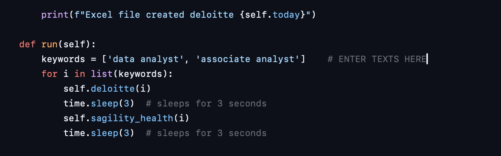

# JOB SCRAPER ON DELOITTE AND SAGILITY CAREERS WEB

```bash
# install these before you run
pip3 install requests bs4 pandas
```

Give it keywords and it will search the websites for you in seconds! note that there is a 6 seconds delay
after each keyword search.

Enter your keyword list like that and run the code


a csv fill will created with todays date. While coding it was kept in mind that you had to only run the code once a day. So Each day a new file will get created.

_NOTE: The city is hard coded for hyderabad, india._
